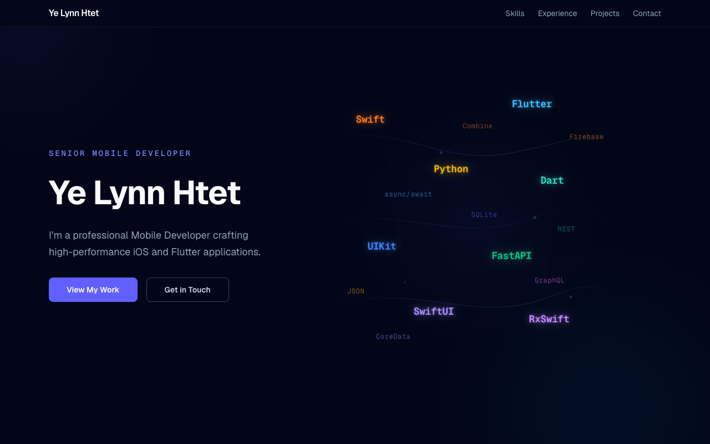

# Ye Lynn Htet — Portfolio

A personal portfolio website for a senior mobile developer specializing in iOS and Flutter applications.

**Live site:** [ye-lynn-htet.vercel.app](https://ye-lynn-htet.vercel.app)

---

## About

This portfolio showcases my work as a senior mobile developer based in Kobe, Japan. It features a clean, modern design with smooth animations and a responsive layout that works across all devices.

### Key Features

- **Animated Hero Section** — Floating programming language tags with smooth animations
- **Responsive Design** — Optimized for desktop, tablet, and mobile devices
- **Accessibility First** — Skip links, keyboard navigation, and screen reader support
- **Performance Optimized** — Static generation with Next.js for fast load times
- **Dark Theme** — Slate-based color palette with indigo accents

---

## Screenshots

*Captured at desktop resolution (1280×800) and mobile (390×844).*

### Desktop




### Mobile

*Mobile screenshots coming soon.*

---

## Tech Stack

| Tool | Version | Purpose |
|------|---------|---------|
| [Next.js](https://nextjs.org) | 16.2 | React framework with App Router |
| [React](https://react.dev) | 19.2 | UI library |
| [Tailwind CSS](https://tailwindcss.com) | v4 | Utility-first styling |
| [TypeScript](https://www.typescriptlang.org) | 5.x | Type safety |
| [Geist Font](https://vercel.com/font) | — | Typography (Sans + Mono) |

---

## Getting Started

### Prerequisites

- Node.js 18+ (recommended: use [nvm](https://github.com/nvm-sh/nvm))
- npm or yarn

### Installation

```bash
# Clone the repository
git clone https://github.com/ye-lynn-htet/ylh-portfolio.git
cd ylh-portfolio

# Install dependencies
npm install

# Start development server
npm run dev
```

Open [http://localhost:3000](http://localhost:3000) in your browser.

### Available Scripts

| Command | Description |
|---------|-------------|
| `npm run dev` | Start development server |
| `npm run build` | Create production build |
| `npm run start` | Start production server |
| `npm run lint` | Run ESLint |

---

## Project Structure

```
src/
├── app/
│   ├── layout.tsx          # Root layout (fonts, metadata, smooth scroll)
│   ├── page.tsx            # Main page with all sections
│   ├── globals.css         # Tailwind imports, animations, scroll reveal
│   ├── components.tsx      # Reusable UI components (SectionLabel, Tag, Cards)
│   ├── fallback-data.ts    # Static data arrays
│   ├── scroll-reveal.tsx   # Intersection Observer scroll animations
│   ├── skills/
│   │   └── page.tsx        # Skills detail page
│   ├── experience/
│   │   └── page.tsx        # Experience detail page
│   └── projects/
│       ├── page.tsx        # Projects listing page
│       └── [slug]/
│           └── page.tsx    # Individual project pages
├── lib/
│   └── slug.ts             # Slug generation utilities
└── types/
    └── portfolio.ts        # TypeScript interfaces
```

---

## Sections

| Section | Description | Features |
|---------|-------------|----------|
| **Header** | Sticky navigation | Backdrop blur, responsive mobile nav |
| **Hero** | Introduction | Animated floating tags, CTA buttons |
| **Skills** | Technical expertise | 4 skill groups with accent colors |
| **Experience** | Work history | Timeline with 4 roles |
| **Projects** | App showcase | 5 projects with App Store links |
| **Contact** | Get in touch | Email, LinkedIn, GitHub, location |

---

## Design System

### Colors

- **Background:** `slate-950` (#020617)
- **Primary Accent:** `indigo-400/500`
- **Secondary Accents:** sky, emerald, amber, violet, rose

### Typography

- **Display:** Geist Sans (bold, tight tracking)
- **Body:** Geist Sans (regular, relaxed leading)
- **Utility:** Geist Mono (uppercase, tracking-widest)

### Components

- `SectionLabel` — Mono eyebrow with indigo decoration
- `AccentBar` — Colored accent bar
- `Tag` — Pill badge with accent border
- `SkillGroupCard` — Skill category card
- `ExperienceCard` — Timeline entry
- `ProjectCard` — Project showcase with hover effects

---

## Accessibility

- Skip-to-content link for keyboard users
- Focus-visible outlines on all interactive elements
- Semantic HTML with ARIA labels
- Reduced motion support via `prefers-reduced-motion`
- Screen reader friendly navigation

---

## Performance

- Static generation (SSG) for all pages
- Optimized images and fonts
- Minimal JavaScript bundle
- Tailwind CSS purging for small CSS output

---

## Deployment

This site is deployed on [Vercel](https://vercel.com).

### Automatic Deployment

Push to `main` branch and Vercel auto-deploys.

### Manual Deployment

```bash
npm run build
npm run start
```

---

## Contributing

This is a personal portfolio project. While not intended for direct reuse, feel free to fork and adapt for your own portfolio.

---

## License

Personal portfolio — not intended for commercial reuse.

---

## Contact

- **Email:** yelynnhtet22798@gmail.com
- **LinkedIn:** [linkedin.com/in/ye-lynn-htet](https://linkedin.com/in/ye-lynn-htet-baa633252)
- **GitHub:** [github.com/ye-lynn-htet](https://github.com/ye-lynn-htet)
- **Location:** Kobe, Japan
