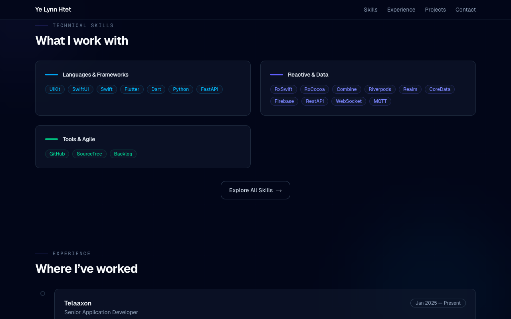
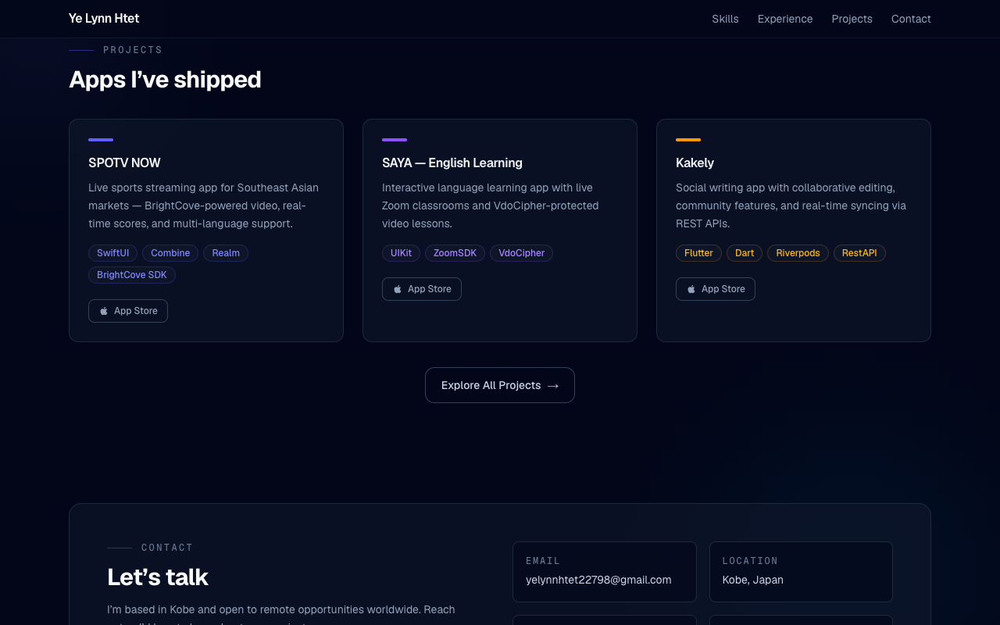

# Ye Lynn Htet — Portfolio

A personal portfolio website for a senior mobile developer (iOS & Flutter).

**Live site:** [ye-lynn-htet.vercel.app](https://ye-lynn-htet.vercel.app)

---

## Screenshots

*Captured with Chrome DevTools MCP at a fixed desktop resolution (1280×800).*






---

## Tech Stack

| Tool | What it does |
|------|-------------|
| [Next.js 16](https://nextjs.org) | React framework (App Router) |
| [React 19](https://react.dev) | UI library |
| [Tailwind CSS v4](https://tailwindcss.com) | Styling |
| [TypeScript 5](https://www.typescriptlang.org) | Type safety |
| [Geist Font](https://vercel.com/font) | Typography |

---

## How to Run

```bash
# Install dependencies
npm install

# Start dev server
npm run dev
```

Open [http://localhost:3000](http://localhost:3000) in your browser.

---

## Project Structure

```
src/
├── app/
│   ├── layout.tsx      # Root layout (fonts, smooth scroll)
│   ├── page.tsx        # Main page with all sections
│   └── globals.css     # Tailwind imports + animations
```

---

## Sections

1. **Header** — Sticky navigation bar
2. **Hero** — Introduction with animated logo orbit
3. **Skills** — iOS, Flutter, and tools
4. **Experience** — Work history timeline
5. **Projects** — App Store and GitHub projects
6. **Contact** — Email, GitHub, location

---

## Deploy

This site is deployed on [Vercel](https://vercel.com). Push to `main` and it deploys automatically.

---

## License

Personal portfolio — not intended for reuse.
